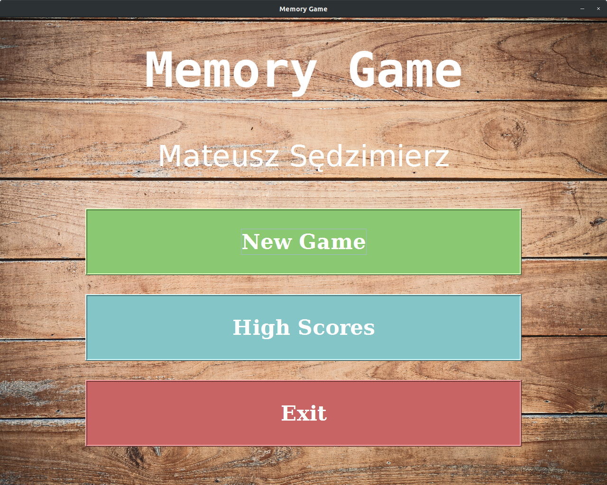
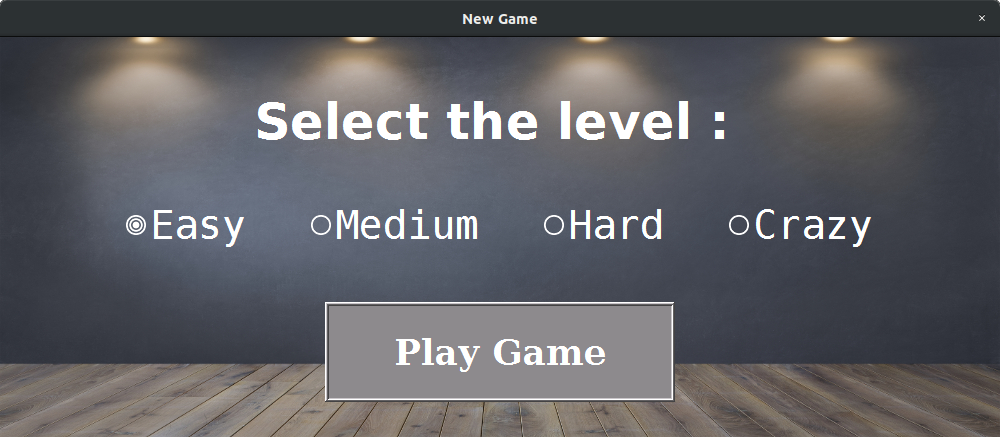
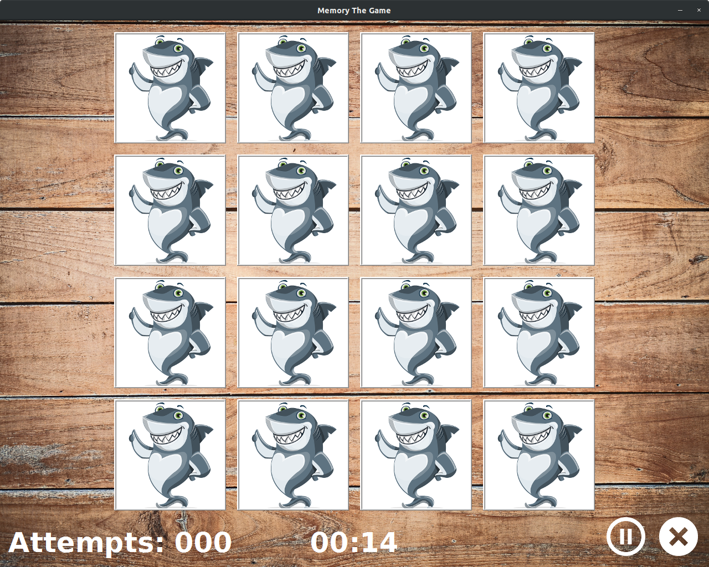
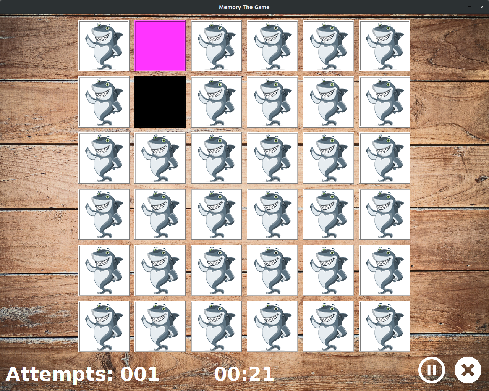
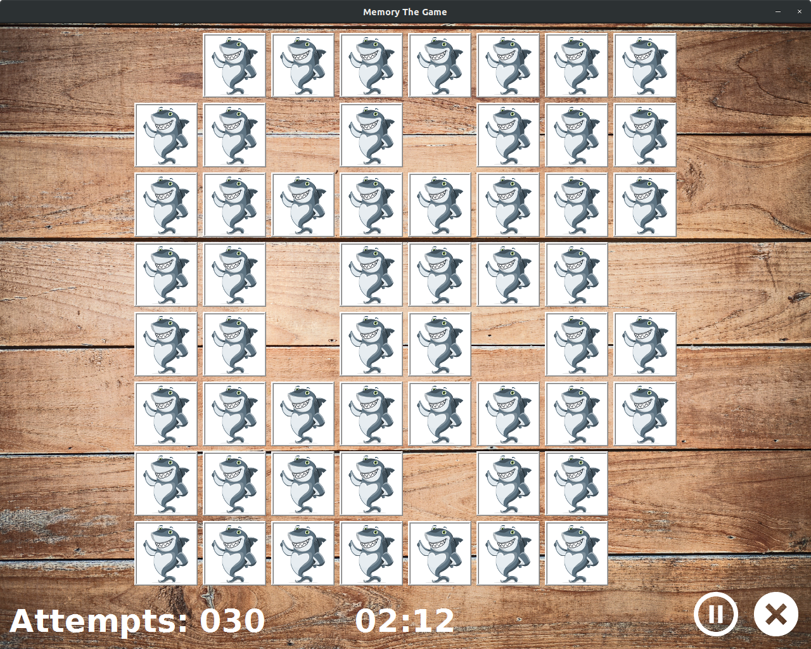
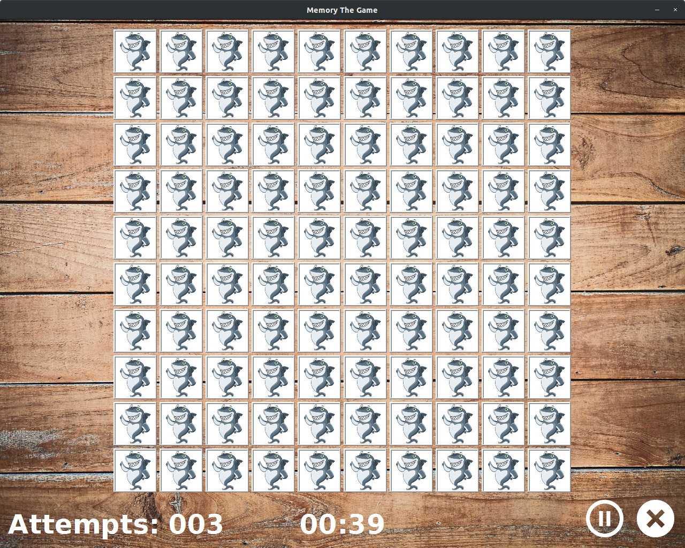
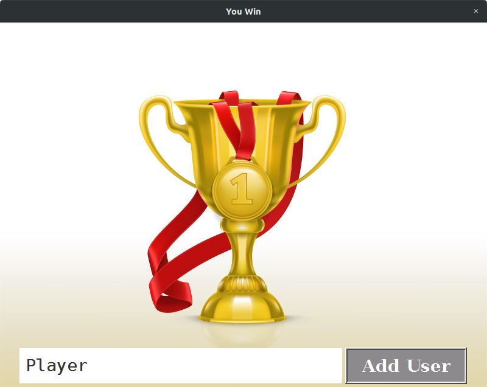
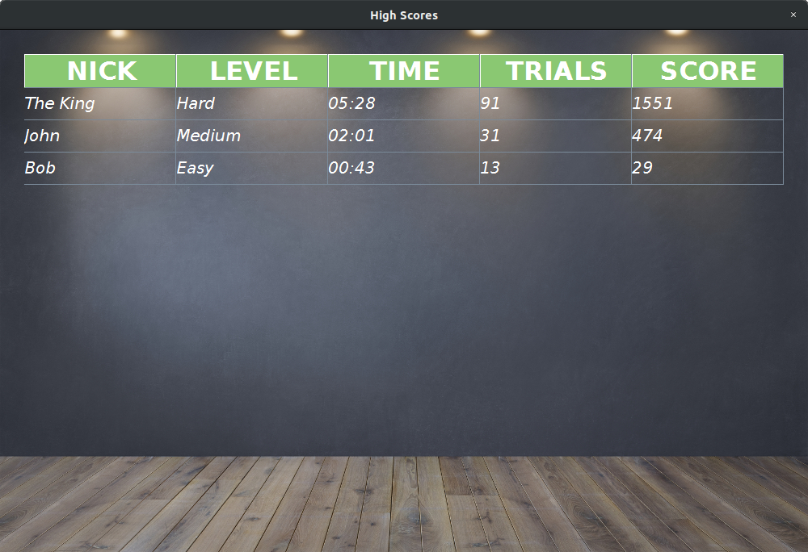

# Memory-Game

Simple memory game - my first application with GUI, created with Java Swing. It was the project for my studies.
See short video from the game 
<a href="https://youtu.be/7JRBGmHYh0Q" > **HERE** </a>

***
## Some screenshots from the game:

#### Main menu

---
#### Selecting level

---
#### Easy level

---
#### Medium level    

---
#### Hard level

---
#### Crazy level

---
#### Win

---
#### High scores

***
## All files and sources:

* Main menu background -> Designed by yingyang / Freepik 
    http://www.freepik.com https://www.freepik.com/free-photo/texture-background_1167457.htm

* Cards and icon image -> Image by GraphicMama-team from Pixabay 
    https://pixabay.com/illustrations/shark-animal-character-cute-ocean-1454245/

* Select level and highscores background -> Designed by rawpixel.com / Freepik 
    https://www.freepik.com/free-photo/dark-gray-wall-with-row-spotlights-empty-room_4100361.htm

* New Score Background -> Designed by vectorpocket / Freepik 
    https://www.freepik.com/free-vector/realistic-illustration-golden-goblet-medal-with-red-ribbon-isolated-background_2891016.htm

* Exit icon -> Icon made by Freepik
    https://www.flaticon.com/free-icon/remove-button_39

* Play button -> Icon made by Appzgear https://www.flaticon.com/authors/appzgear
    https://www.flaticon.com/free-icon/play-button_26025#term=play&page=1&position=7

* Pause button -> Icon made by Freepik
    https://www.flaticon.com/free-icon/round-pause-button_85622#term=rounded%20pause&page=1&position=31

* Clear dot -> Icon made by John Somers https://www.flaticon.com/authors/josh-somers
    https://www.flaticon.com/free-icon/dots-clear_104289#term=dots%20clear&page=1&position=1

* Target dot -> Icon made by Dave Gandy https://www.flaticon.com/authors/dave-gandy
    https://www.flaticon.com/free-icon/bullseye_25221

